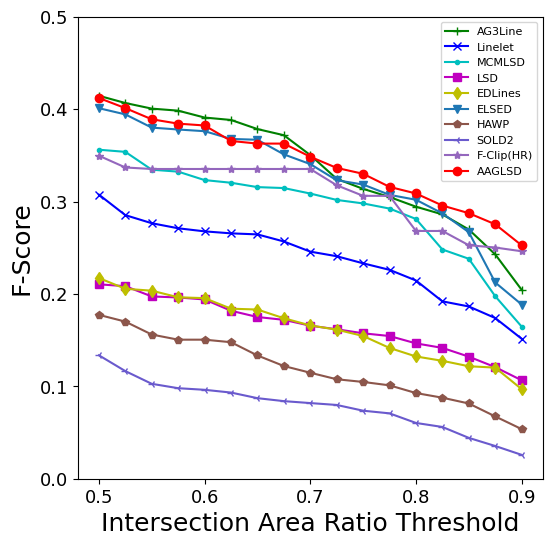
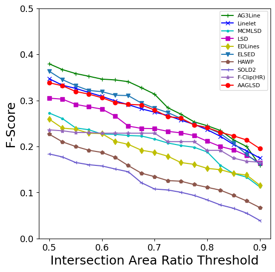
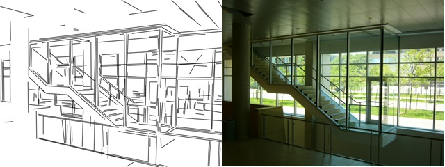

# AAGLSD
Aligned-Anchor Groups Guided Line Segment Detector 

Followings are brief description of each folder:
- src: the implementation of AAGLSD.
- pred_results: the .txt files of predicted line segments, each row is a line segment presented as ***[x0, y0, x1, y1]***.

## Requirements
- **C++17**
- **OpenCV >=4.6.0**

## Evaluation Results on the YorkUrban and the YorkUrban-LineSegment
  

  

## Prediction Results on the YorkUrban
### Image #11  
  

### Image #15  
  
