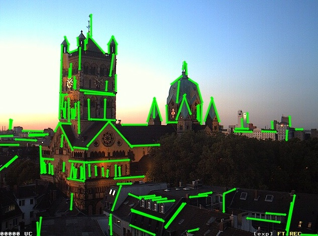

# 😎ALIGNED ANCHOR GROUPS GUIDED LINE SEGMENT DETECTOR
## 😊Introduction
The implementation of paper **"ALIGNED ANCHOR GROUPS GUIDED LINE SEGMENT DETECTOR"**. 

Followings are brief description of each folder:
```
AAGLSD/
├── evaluation:   Code for evaluation. 
├── imgs:         Images for readme.
├── pred_results: Results from different line segment detectors. 
├── src/
│    ├── src_cpp:  C++ implementation of AAGLSD.
│    └── src_py:   Python implementation of AAGLSD.
└── README.md
```
p.s.
- evaluation: Only `repeatbility` evaluation is available. For the other metrics we adopted, the code is from [AG3Line](https://github.com/weidong-whu/AG3line) now. The python code would be assembled soon.
- pred_results: Detected line segments from different line segment detectors. Each row a `.txt` file is a line segment represented as endpoint-endpoint`[x0, y0, x1, y1]`, which means endpoint-endpoint. The suffix represents the type of LSD (e.g. `*aag.txt`).

## ⚙️ USAGE

### Visual Studio
1. Download [OpenCV](https://opencv.org/releases/page/1/) on windows.
2. Include all `.cpp` and `.hpp` files in `src_cpp` into your project.
3. Add the `.dll` and `.lib` files of `OpenCV` to your enviroment path.
4. Set your C++ Compiler to C++14 or higher.
___
### CMake
1. Prerequisites
   - **CMake ≥ 3.10**
   - **OpenCV ≥ 4.0.1** (Make sure `OpenCV_DIR` points to `<opencv-root>/lib/cmake/opencv4` if not in default search paths)
   - **C++14 (or higher) compliant compiler**

2. Build
    ```bash
    # Clone / extract the project
    git clone https://github.com/LLiDaBao/AAGLSD.git
    cd AAGLSD/src/src_cpp               # project root

    # Configure
    mkdir build && cd build
    cmake ..                 # add -DOpenCV_DIR=... if necessary

    # Compile
    cmake --build . -j$(nproc)
    ```
    After successful compilation the executable AlignED (or AlignED.exe on Windows) will be created inside the build/ folder.

3. Run
 - Edit main.cpp and replace the placeholder paths:
 ```
 // 1. Image folder
 listDirRecursively(filenames, "/path/to/YorkUrbanDB", ".jpg");

 // 2. ground-truth labels 
 extractYUK("/path/to/yuk-linelet-labels/" + labelname + ".txt", gt);

 // 3. Output folder
 cv::imwrite("/path/to/output/" + imgname, res);
 write2txt(lineSegments, "/path/to/output/", imgPath);
 ```
- Then simply execute:
```bash
./AlignED
```


## 🚀 TODO
- [x] Date: 2025.06.30.
  - Release C++ source code of our AAGLSD.
  - Release `repeatability` evaluation code.

- [x] Date: 2025.8.23.
  - 🥰Our paper is accepted by **PRCV2025** (The 8th Chinese Conference on Pattern Recognition and Computer Vision).
- [ ] Release python code for AAGLSD and metrics evaluation (AP,AR,IoU,F-Score).


## 📖 Evaluation Results on the YorkUrbanDB
The F-Score for different line segment detectors evaluated on the [YorkUrbanDB](https://www.elderlab.yorku.ca/resources/york-urban-line-segment-database-information/), and the YorkUrban-LineSegment from [Linelet](https://github.com/NamgyuCho/Linelet-code-and-YorkUrban-LineSegment-DB).
### 📗YorkUrbanDB
<div align="center">
    
    
    
</div>

### 📗YorkUrban-LineSegment
<div align="center">
    
    
    
</div>

## ⏰ Visulization
From left to right: 

- *Aligned Anchor Groups*
- *Regular Anchors*
- *Detected Line Segments*
### YorkUrban Visualization
<div align="center">
     
     
     
</div> 

<div align="center">
     
     
     
</div> 

### HPatches Visualization
We also evaluated on the illumination subset of [HPathces](https://github.com/hpatches/hpatches-dataset). Here is the example of `castle` and `book` sequences.
<div align="center">
     
     
     
</div> 

<div align="center">
     
     
     
</div> 

<div align="center">
     
     
     
</div> 

<div align="center">
     
     
     
</div
