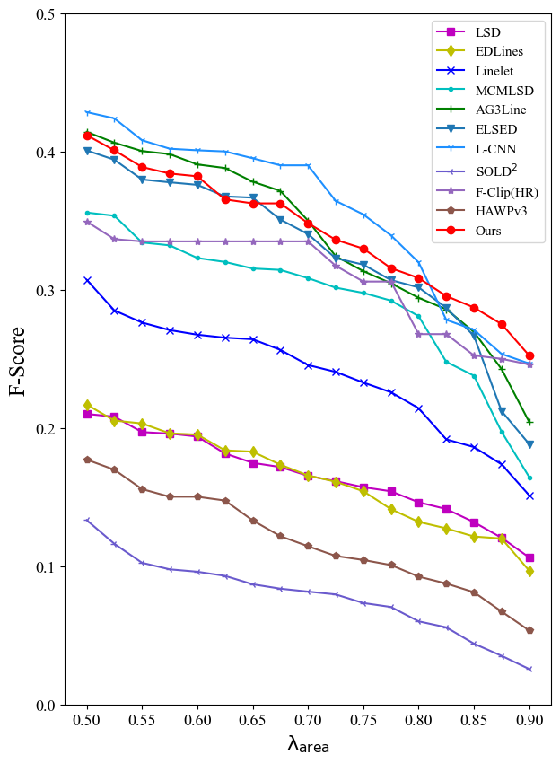
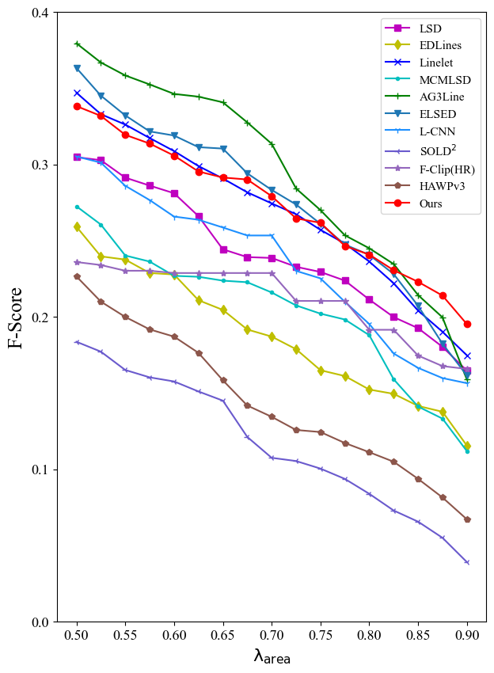

## 😊Introduction
The C++ implementation of paper *"ALIGNED ANCHOR GROUPS GUIDED LINE SEGMENT DETECTOR"*. 

Followings are brief description of each folder:
- src: the C++ implementation of AAGLSD.
- pred_results: the `.txt` files of predicted line segments, each row is a line segment represented as `[x0, y0, x1, y1]`, which means endpoint-endpoint.

## 🚀 TODO
- [x] Release C++ source code of our AAGLSD.
- [ ] Optimize code and release python version...

## 📖 Evaluation Results on the YorkUrbanDB
The F-Score for different LSD, the left is evaluated on [YorkUrbanDB](https://www.elderlab.yorku.ca/resources/york-urban-line-segment-database-information/), and the right is on YorkUrban-Line Segment from [Linelet](https://github.com/NamgyuCho/Linelet-code-and-YorkUrban-LineSegment-DB).

    
     

## ⏰ Visulization
From left to right: 

- *Aligned Anchor Groups*
- *Regular Anchors*
- *Detected Line Segments*
### YorkUrban Visualization

     
     
     

 

     
     
     

 

### HPatches Visualization
We also evaluated on the illumination subset of [HPathces](https://github.com/hpatches/hpatches-dataset). Here is the example of 'castle' sequence.

     
     
     

 

     
     
     

 